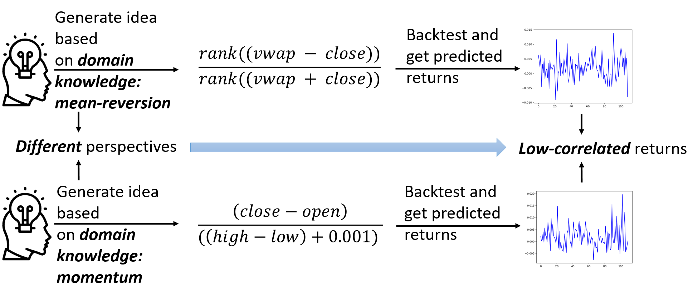
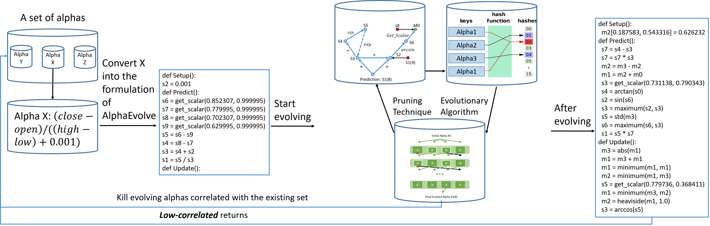

# AlphaEvolve

The repository is the official implementation of [AlphaEvolve: A Learning Framework to Discover Novel Alphas in Quantitative Investment](https://arxiv.org/abs/2103.16196).

Alphas are mathematical expressions that are predictive for next day's returns. The key idea of AlphaEvolve is to automate the alpha generation process motivated by human experts: 

AlphaEvolve is an evolutionary framework based on AutoML. The framework guides the evolutionary process from generating a machine learning algorithm to a predictive alpha, which helps evolving an initial alpha to a better alpha with high dimentional features:



## Environment:

We run our experiments on Intel(R) Xeon(R) W-2133 CPU @ 3.60GHz. Mutiple CPUs are recommended for running alpha initializations in parallel. 

## Requirements:

Install Bazel version of 4.2.1 from the below link, and g++>=9 is required. Python version 3.8.8 is used in running deep learning models.
[https://docs.bazel.build/versions/main/install-ubuntu.html](https://docs.bazel.build/versions/main/install-ubuntu.html)

## Data:

The data folder contains ten years of U.S. stocks from 2013 to 2022 downloaded from Eikon. You can complement the data with relational data from the `data` folder in the below GitHub repository. 
[https://github.com/fulifeng/Temporal_Relational_Stock_Ranking](https://github.com/fulifeng/Temporal_Relational_Stock_Ranking)

## Alpha search commands to generate new alphas:

Generate a dataset for AlphaEvolve as inputs using raw data (i.e., open/high/low/close/volume) for five years from 2017-1-2 to 2022-1-2.
```
python preprocess/generate_datasets.py -input_path $(pwd)/raw_data/eikon_data -output_path $(pwd)/processed_data/data_for_ALL_search -market ALL -num_train_examples 750 -num_valid_examples 459 -start_date 2017-1-2 -end_date 2022-1-2
```

Run an automatic alpha search using previous rounds' searched alphas' outputs on validation dataset as cutoff and using good alphas as initial alphas:
```
./search_alpha_experiments_using_best_alphas.sh -r 1 -o YOUR_OUTPUT_FOLDER_NAME -b 5 -t 5 -m ALL -n 3000 -i $(pwd)/processed_data/data_for_ALL_search -a 750 -c 459
```
## Alpha evaluation commands to evaluate a given alpha:

Generate a dataset for AlphaEvolve as inputs using raw data (i.e., open/high/low/close/volume) for two years from 2017-1-2 to 2019-1-2.
```
python preprocess/generate_datasets.py -input_path $(pwd)/raw_data/eikon_data -output_path $(pwd)/processed_data/data_for_ALL_evaluate -market ALL -num_train_examples 13 -num_valid_examples 459 -start_date 2017-1-2 -end_date 2019-1-2
```

Run an alpha evaluation for 5 minutes using your own designed alpha for the NYSE and NASDAQ datasets with 3000 stocks (5 minutes is just an arbitrary time limit probably enough to initialize and evaluate the alpha). The given alpha is a simple momentum alpha, i.e., the 101st alpha in "formulaic alpha 101". paper
```
timeout 5m bash ./run.sh -a MY_ALPHA -p YOUR_OUTPUT_PATH_FOR_ALPHA_PERFORMANCE_RESULTS  -m $(pwd)/initial_alphas/my_alpha_101.txt -s 100000000000 -v "" -t "" -g YOUR_OUTPUT_PATH_FOR_PREDICTION_VALUES -b ALL -f 3000 -h 13 -j 459 -o $(pwd)/processed_data/data_for_ALL_evaluate
```

## Results

After executing the alpha search command, the results will be generated in your output folder similar to the `results_example`. In this folder, the parallel-executed evolutionary processes are named with different random seeds. Each of the folders contains detailed results for the evolutionary processes. The best results in each round among all processes are included in the folder named `best_in_each_round`. The results are four types of files: `XXXth_Alpha.txt` is the XXXth-generated alpha during the evolutionary process; `XXXth_Performance.txt` is the metrics of the corresponding alpha; `XXXth_Pruned_Alpha.txt` is the simplied version pruning invalid operations in `XXXth_Alpha.txt`; `figure_YYY.png` plots the whole evoluation process of YYY random seed.
